# TrackEcom architecture diagrams

Mermaid diagrams of the architecture as built in `dev` (commit `83988fe`, 2026-11-01), plus the planned parts, marked as such. GitHub renders them directly. The requirements behind them are in the [SRS](../srs/README.md); the decisions are in [ADR-0001](../adr/0001-architecture-and-stack.md) to [ADR-0005](../adr/0005-public-api.md).

Legend used in the flowcharts: solid boxes are built, dashed boxes (`planned`) are not built yet.

| # | Diagram |
|---|---|
| 1 | [System context](#1-system-context) |
| 2 | [Containers, ports and data stores](#2-containers-ports-and-data-stores) |
| 3 | [Monorepo packages](#3-monorepo-packages) |
| 4 | [Inside one service](#4-inside-one-service) |
| 5 | [Event flow between services](#5-event-flow-between-services) |
| 6 | [Request path, authentication and tenant check](#6-request-path-authentication-and-tenant-check) |
| 7 | [Order intake: manual and shop import](#7-order-intake-manual-and-shop-import) |
| 8 | [Confirmation call](#8-confirmation-call) |
| 9 | [Shipping an order to a carrier](#9-shipping-an-order-to-a-carrier) |
| 10 | [Tracking, customer messages and COD reconciliation](#10-tracking-customer-messages-and-cod-reconciliation) |
| 11 | [Data owned by each service](#11-data-owned-by-each-service) |
| 12 | [Order and parcel status](#12-order-and-parcel-status) |
| 13 | [Deployment](#13-deployment) |
| 14 | [CI/CD and environments](#14-cicd-and-environments) |
| 15 | [Target architecture (Phase 3 and 4)](#15-target-architecture-phase-3-and-4) |

## 1. System context

Who and what TrackEcom talks to.

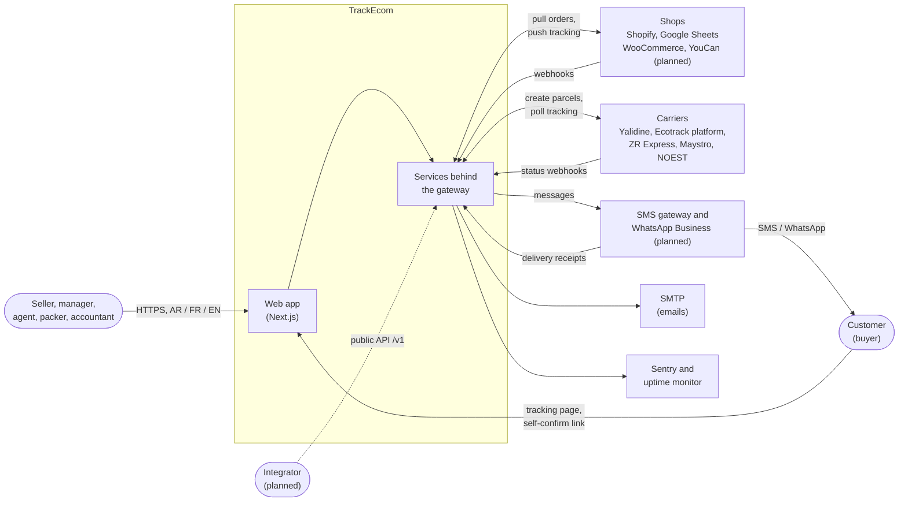
```mermaid
flowchart LR
    seller(["Seller, manager,<br/>agent, packer, accountant"])
    customer(["Customer<br/>(buyer)"])
    integrator(["Integrator<br/>(planned)"])

    subgraph te["TrackEcom"]
        web["Web app<br/>(Next.js)"]
        api["Services behind<br/>the gateway"]
    end

    shops["Shops<br/>Shopify, Google Sheets<br/>WooCommerce, YouCan (planned)"]
    carriers["Carriers<br/>Yalidine, Ecotrack platform,<br/>ZR Express, Maystro, NOEST"]
    msg["SMS gateway and<br/>WhatsApp Business (planned)"]
    smtp["SMTP<br/>(emails)"]
    sentry["Sentry and<br/>uptime monitor"]

    seller -->|"HTTPS, AR / FR / EN"| web
    web --> api
    customer -->|"tracking page,<br/>self-confirm link"| web
    integrator -.->|"public API /v1"| api
    api <-->|"pull orders,<br/>push tracking"| shops
    shops -->|webhooks| api
    api <-->|"create parcels,<br/>poll tracking"| carriers
    carriers -->|status webhooks| api
    api -->|messages| msg
    msg -->|delivery receipts| api
    msg -->|SMS / WhatsApp| customer
    api --> smtp
    api --> sentry
```

## 2. Containers, ports and data stores

Every service owns its own PostgreSQL database; nothing reads another service's tables. Redis carries the event streams, caches and rate limits.

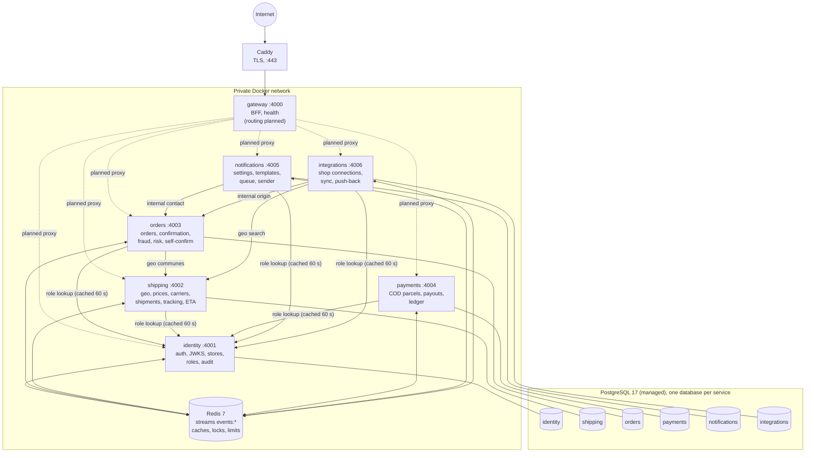
```mermaid
flowchart TB
    internet(("Internet"))
    caddy["Caddy<br/>TLS, :443"]

    subgraph private["Private Docker network"]
        gateway["gateway :4000<br/>BFF, health<br/>(routing planned)"]
        identity["identity :4001<br/>auth, JWKS, stores,<br/>roles, audit"]
        shipping["shipping :4002<br/>geo, prices, carriers,<br/>shipments, tracking, ETA"]
        orders["orders :4003<br/>orders, confirmation,<br/>fraud, risk, self-confirm"]
        payments["payments :4004<br/>COD parcels, payouts,<br/>ledger"]
        notifications["notifications :4005<br/>settings, templates,<br/>queue, sender"]
        integrations["integrations :4006<br/>shop connections,<br/>sync, push-back"]
        redis[("Redis 7<br/>streams events:*<br/>caches, locks, limits")]
    end

    subgraph pg["PostgreSQL 17 (managed), one database per service"]
        dbI[("identity")]
        dbS[("shipping")]
        dbO[("orders")]
        dbP[("payments")]
        dbN[("notifications")]
        dbX[("integrations")]
    end

    internet --> caddy --> gateway
    gateway -.->|"planned proxy"| identity & orders & shipping & payments & notifications & integrations

    identity --- dbI
    shipping --- dbS
    orders --- dbO
    payments --- dbP
    notifications --- dbN
    integrations --- dbX

    orders & shipping & payments & notifications & integrations -->|"role lookup (cached 60 s)"| identity
    orders -->|"geo communes"| shipping
    integrations -->|"geo search"| shipping
    notifications -->|"internal contact"| orders
    integrations -->|"internal origin"| orders

    identity & orders & shipping & payments & notifications & integrations <--> redis
```

## 3. Monorepo packages

Who depends on which shared package (pnpm workspaces + Turborepo).

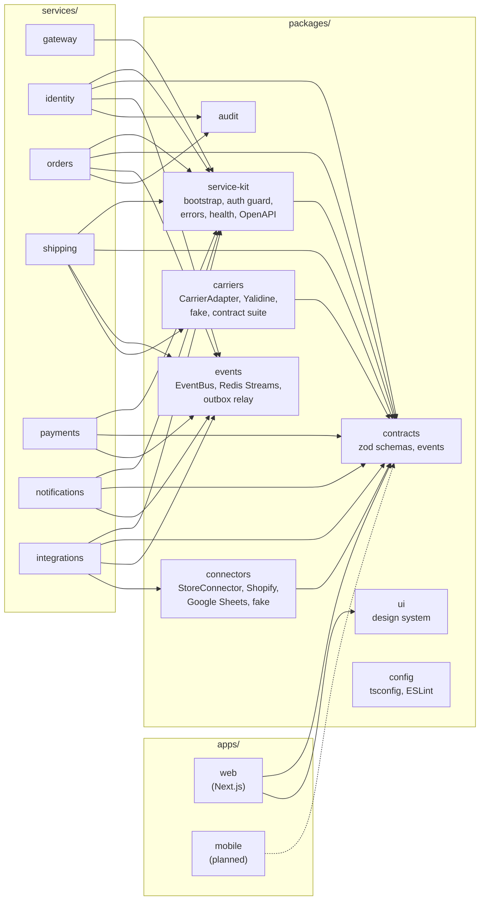
```mermaid
flowchart LR
    subgraph apps["apps/"]
        web["web<br/>(Next.js)"]
        mobile["mobile<br/>(planned)"]
    end

    subgraph services["services/"]
        gw[gateway]
        idn[identity]
        ord[orders]
        shp[shipping]
        pay[payments]
        ntf[notifications]
        intg[integrations]
    end

    subgraph packages["packages/"]
        contracts["contracts<br/>zod schemas, events"]
        events["events<br/>EventBus, Redis Streams,<br/>outbox relay"]
        kit["service-kit<br/>bootstrap, auth guard,<br/>errors, health, OpenAPI"]
        audit["audit"]
        carriers["carriers<br/>CarrierAdapter, Yalidine,<br/>fake, contract suite"]
        connectors["connectors<br/>StoreConnector, Shopify,<br/>Google Sheets, fake"]
        ui["ui<br/>design system"]
        config["config<br/>tsconfig, ESLint"]
    end

    web --> contracts & ui
    mobile -.-> contracts
    gw --> kit
    idn & ord & shp & pay & ntf & intg --> kit & contracts & events
    idn & ord --> audit
    shp --> carriers
    intg --> connectors
    kit --> contracts
    carriers --> contracts
    connectors --> contracts
```

## 4. Inside one service

Every service uses the same clean-architecture layout (ADR-0001, `service-architecture` skill). Dependencies point inwards only.

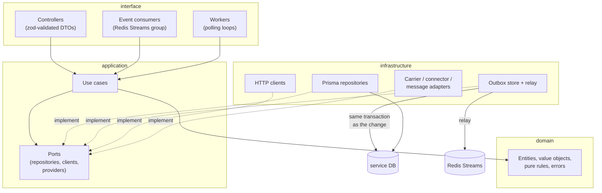
```mermaid
flowchart TB
    subgraph iface["interface"]
        ctrl["Controllers<br/>(zod-validated DTOs)"]
        cons["Event consumers<br/>(Redis Streams group)"]
        work["Workers<br/>(polling loops)"]
    end
    subgraph app["application"]
        uc["Use cases"]
        ports["Ports<br/>(repositories, clients,<br/>providers)"]
    end
    subgraph dom["domain"]
        rules["Entities, value objects,<br/>pure rules, errors"]
    end
    subgraph infra["infrastructure"]
        prisma["Prisma repositories"]
        outbox["Outbox store + relay"]
        http["HTTP clients"]
        adapters["Carrier / connector /<br/>message adapters"]
    end

    ctrl & cons & work --> uc
    uc --> rules
    uc --> ports
    prisma & outbox & http & adapters -.->|implement| ports
    outbox -->|"same transaction<br/>as the change"| db[("service DB")]
    prisma --> db
    outbox -->|relay| redis[("Redis Streams")]
```

## 5. Event flow between services

One stream per producing service (`events:<service>`). Each consumer module has its own consumer group, so every replica shares the work and each event is handled once per group.

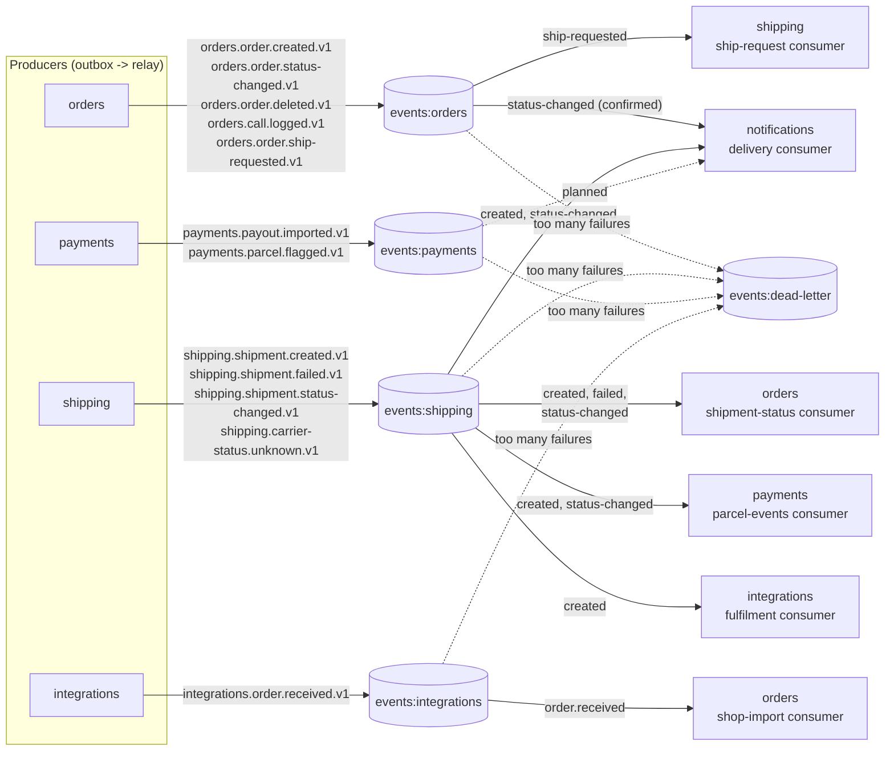
```mermaid
flowchart LR
    subgraph producers["Producers (outbox -> relay)"]
        O["orders"]
        S["shipping"]
        P["payments"]
        I["integrations"]
    end

    O -->|"orders.order.created.v1<br/>orders.order.status-changed.v1<br/>orders.order.deleted.v1<br/>orders.call.logged.v1<br/>orders.order.ship-requested.v1"| so[("events:orders")]
    S -->|"shipping.shipment.created.v1<br/>shipping.shipment.failed.v1<br/>shipping.shipment.status-changed.v1<br/>shipping.carrier-status.unknown.v1"| ss[("events:shipping")]
    P -->|"payments.payout.imported.v1<br/>payments.parcel.flagged.v1"| sp[("events:payments")]
    I -->|"integrations.order.received.v1"| si[("events:integrations")]

    so -->|ship-requested| Sc["shipping<br/>ship-request consumer"]
    so -->|"status-changed (confirmed)"| Nc["notifications<br/>delivery consumer"]
    ss -->|"created, failed,<br/>status-changed"| Oc["orders<br/>shipment-status consumer"]
    ss -->|"created, status-changed"| Pc["payments<br/>parcel-events consumer"]
    ss -->|"created, status-changed"| Nc
    ss -->|created| Ic["integrations<br/>fulfilment consumer"]
    si -->|order.received| Oi["orders<br/>shop-import consumer"]
    sp -.->|"planned"| Nc
    so & ss & sp & si -.->|"too many failures"| dl[("events:dead-letter")]
```

## 6. Request path, authentication and tenant check

How an authenticated call reaches a service and how `storeId` is resolved. Gateway routing is planned; services already enforce the same checks themselves.

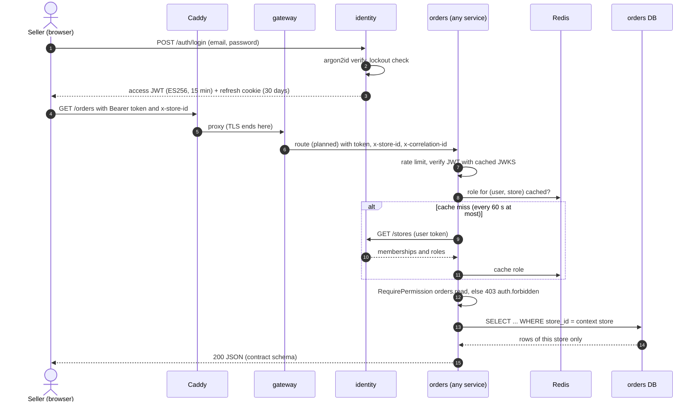
```mermaid
sequenceDiagram
    autonumber
    actor U as Seller (browser)
    participant C as Caddy
    participant G as gateway
    participant I as identity
    participant O as orders (any service)
    participant R as Redis
    participant DB as orders DB

    U->>I: POST /auth/login (email, password)
    I->>I: argon2id verify, lockout check
    I-->>U: access JWT (ES256, 15 min) + refresh cookie (30 days)
    U->>C: GET /orders with Bearer token and x-store-id
    C->>G: proxy (TLS ends here)
    G->>O: route (planned) with token, x-store-id, x-correlation-id
    O->>O: rate limit, verify JWT with cached JWKS
    O->>R: role for (user, store) cached?
    alt cache miss (every 60 s at most)
        O->>I: GET /stores (user token)
        I-->>O: memberships and roles
        O->>R: cache role
    end
    O->>O: RequirePermission orders.read, else 403 auth.forbidden
    O->>DB: SELECT ... WHERE store_id = context store
    DB-->>O: rows of this store only
    O-->>U: 200 JSON (contract schema)
```

## 7. Order intake: manual and shop import

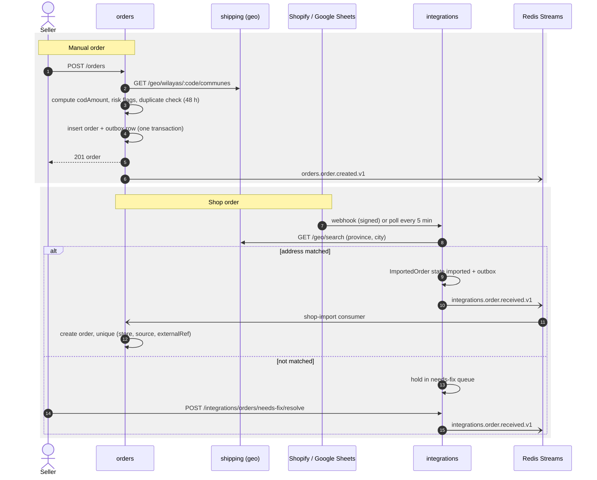
```mermaid
sequenceDiagram
    autonumber
    actor S as Seller
    participant O as orders
    participant SH as shipping (geo)
    participant SHOP as Shopify / Google Sheets
    participant X as integrations
    participant R as Redis Streams

    rect rgb(240, 240, 240)
    note over S,O: Manual order
    S->>O: POST /orders
    O->>SH: GET /geo/wilayas/:code/communes
    O->>O: compute codAmount, risk flags, duplicate check (48 h)
    O->>O: insert order + outbox row (one transaction)
    O-->>S: 201 order
    O-)R: orders.order.created.v1
    end

    rect rgb(240, 240, 240)
    note over SHOP,O: Shop order
    SHOP->>X: webhook (signed) or poll every 5 min
    X->>SH: GET /geo/search (province, city)
    alt address matched
        X->>X: ImportedOrder state imported + outbox
        X-)R: integrations.order.received.v1
        R-)O: shop-import consumer
        O->>O: create order, unique (store, source, externalRef)
    else not matched
        X->>X: hold in needs-fix queue
        S->>X: POST /integrations/orders/needs-fix/resolve
        X-)R: integrations.order.received.v1
    end
    end
```

## 8. Confirmation call

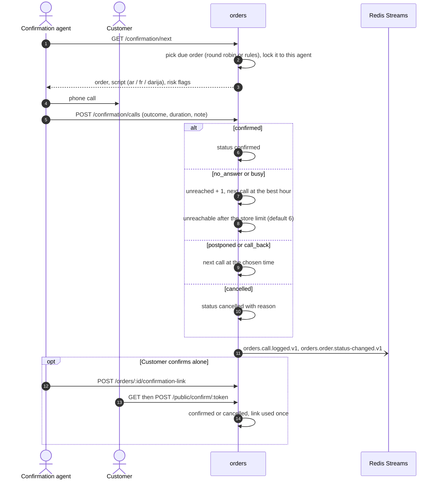
```mermaid
sequenceDiagram
    autonumber
    actor A as Confirmation agent
    actor C as Customer
    participant O as orders
    participant R as Redis Streams

    A->>O: GET /confirmation/next
    O->>O: pick due order (round robin or rules), lock it to this agent
    O-->>A: order, script (ar / fr / darija), risk flags
    A->>C: phone call
    A->>O: POST /confirmation/calls (outcome, duration, note)
    alt confirmed
        O->>O: status confirmed
    else no_answer or busy
        O->>O: unreached + 1, next call at the best hour
        O->>O: unreachable after the store limit (default 6)
    else postponed or call_back
        O->>O: next call at the chosen time
    else cancelled
        O->>O: status cancelled with reason
    end
    O-)R: orders.call.logged.v1, orders.order.status-changed.v1
    opt Customer confirms alone
        A->>O: POST /orders/:id/confirmation-link
        C->>O: GET then POST /public/confirm/:token
        O->>O: confirmed or cancelled, link used once
    end
```

## 9. Shipping an order to a carrier

`createShipmentOnce` sends our reference as the carrier's order id and checks for an existing parcel before each retry, so a parcel is never created twice.

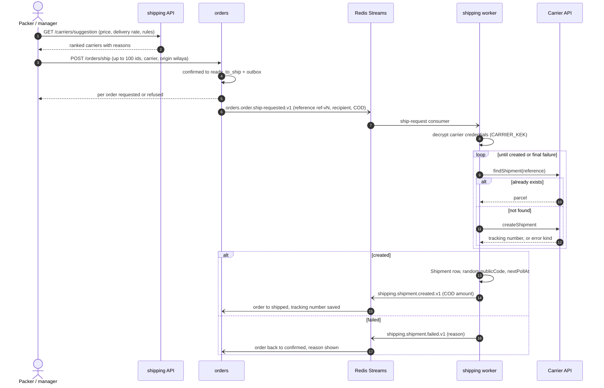
```mermaid
sequenceDiagram
    autonumber
    actor P as Packer / manager
    participant SA as shipping API
    participant O as orders
    participant R as Redis Streams
    participant S as shipping worker
    participant K as Carrier API

    P->>SA: GET /carriers/suggestion (price, delivery rate, rules)
    SA-->>P: ranked carriers with reasons
    P->>O: POST /orders/ship (up to 100 ids, carrier, origin wilaya)
    O->>O: confirmed to ready_to_ship + outbox
    O-->>P: per order requested or refused
    O-)R: orders.order.ship-requested.v1 (reference ref-vN, recipient, COD)
    R-)S: ship-request consumer
    S->>S: decrypt carrier credentials (CARRIER_KEK)
    loop until created or final failure
        S->>K: findShipment(reference)
        alt already exists
            K-->>S: parcel
        else not found
            S->>K: createShipment
            K-->>S: tracking number, or error kind
        end
    end
    alt created
        S->>S: Shipment row, random publicCode, nextPollAt
        S-)R: shipping.shipment.created.v1 (COD amount)
        R-)O: order to shipped, tracking number saved
    else failed
        S-)R: shipping.shipment.failed.v1 (reason)
        R-)O: order back to confirmed, reason shown
    end
```

## 10. Tracking, customer messages and COD reconciliation

### 10.1 A parcel moves

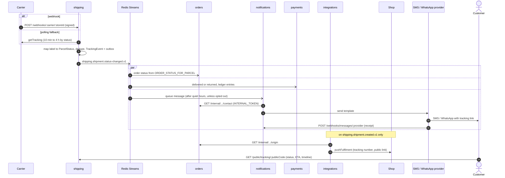
```mermaid
sequenceDiagram
    autonumber
    participant K as Carrier
    participant S as shipping
    participant R as Redis Streams
    participant O as orders
    participant N as notifications
    participant P as payments
    participant X as integrations
    participant SHOP as Shop
    participant M as SMS / WhatsApp provider
    actor C as Customer

    alt webhook
        K->>S: POST /webhooks/:carrier/:storeId (signed)
    else polling fallback
        S->>K: getTracking (10 min to 4 h by status)
    end
    S->>S: map label to ParcelStatus, dedupe, TrackingEvent + outbox
    S-)R: shipping.shipment.status-changed.v1
    par
        R-)O: order status from ORDER_STATUS_FOR_PARCEL
    and
        R-)P: delivered or returned, ledger entries
    and
        R-)N: queue message (after quiet hours, unless opted out)
        N->>O: GET /internal/.../contact (INTERNAL_TOKEN)
        N->>M: send template
        M->>C: SMS / WhatsApp with tracking link
        M->>N: POST /webhooks/messages/:provider (receipt)
    end
    note over X,SHOP: on shipping.shipment.created.v1 only
    X->>O: GET /internal/.../origin
    X->>SHOP: pushFulfilment (tracking number, public link)
    C->>S: GET /public/tracking/:publicCode (status, ETA, timeline)
```

### 10.2 COD money

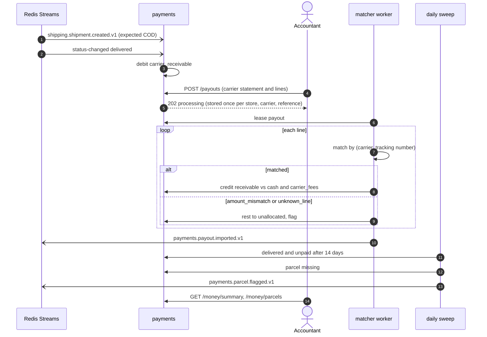
```mermaid
sequenceDiagram
    autonumber
    participant R as Redis Streams
    participant P as payments
    actor A as Accountant
    participant W as matcher worker
    participant J as daily sweep

    R-)P: shipping.shipment.created.v1 (expected COD)
    R-)P: status-changed delivered
    P->>P: debit carrier_receivable
    A->>P: POST /payouts (carrier statement and lines)
    P-->>A: 202 processing (stored once per store, carrier, reference)
    W->>P: lease payout
    loop each line
        W->>W: match by (carrier, tracking number)
        alt matched
            W->>P: credit receivable vs cash and carrier_fees
        else amount_mismatch or unknown_line
            W->>P: rest to unallocated, flag
        end
    end
    W-)R: payments.payout.imported.v1
    J->>P: delivered and unpaid after 14 days
    J->>P: parcel missing
    J-)R: payments.parcel.flagged.v1
    A->>P: GET /money/summary, /money/parcels
```

## 11. Data owned by each service

Main tables only; every business table also carries `store_id`. Outbox and processed-event tables are left out.

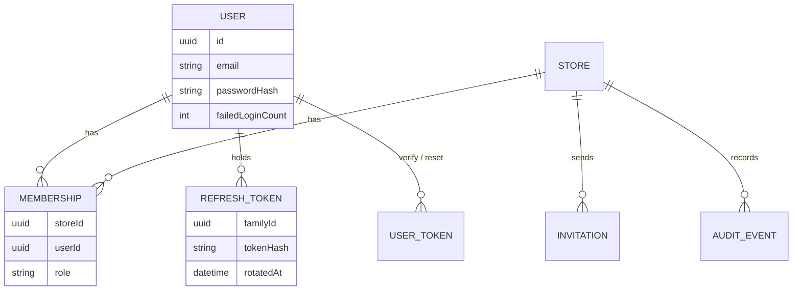
```mermaid
erDiagram
    USER ||--o{ MEMBERSHIP : has
    STORE ||--o{ MEMBERSHIP : has
    STORE ||--o{ INVITATION : sends
    USER ||--o{ REFRESH_TOKEN : holds
    USER ||--o{ USER_TOKEN : "verify / reset"
    STORE ||--o{ AUDIT_EVENT : records
    USER {
        uuid id
        string email
        string passwordHash
        int failedLoginCount
    }
    MEMBERSHIP {
        uuid storeId
        uuid userId
        string role
    }
    REFRESH_TOKEN {
        uuid familyId
        string tokenHash
        datetime rotatedAt
    }
```

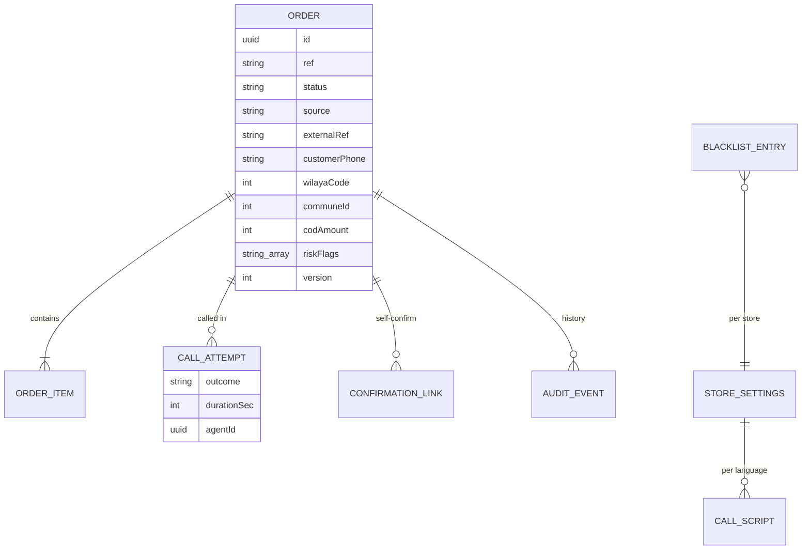
```mermaid
erDiagram
    ORDER ||--|{ ORDER_ITEM : contains
    ORDER ||--o{ CALL_ATTEMPT : "called in"
    ORDER ||--o{ CONFIRMATION_LINK : "self-confirm"
    ORDER ||--o{ AUDIT_EVENT : history
    STORE_SETTINGS ||--o{ CALL_SCRIPT : "per language"
    BLACKLIST_ENTRY }o--|| STORE_SETTINGS : "per store"
    ORDER {
        uuid id
        string ref
        string status
        string source
        string externalRef
        string customerPhone
        int wilayaCode
        int communeId
        int codAmount
        string_array riskFlags
        int version
    }
    CALL_ATTEMPT {
        string outcome
        int durationSec
        uuid agentId
    }
```

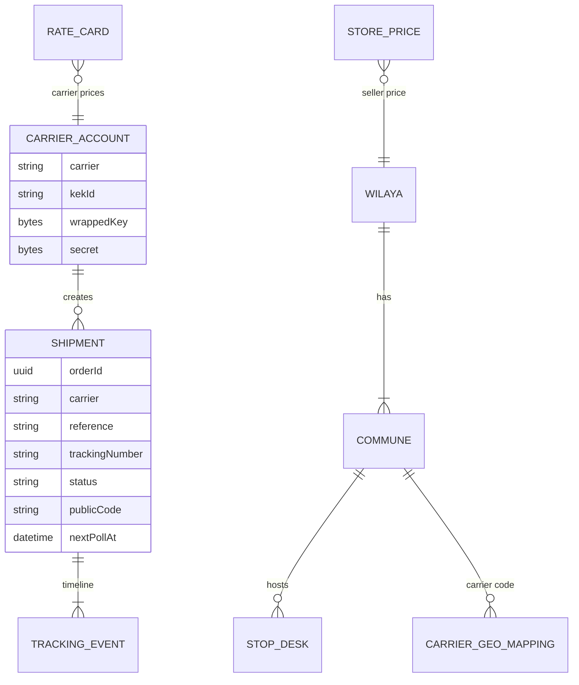
```mermaid
erDiagram
    WILAYA ||--|{ COMMUNE : has
    COMMUNE ||--o{ STOP_DESK : hosts
    COMMUNE ||--o{ CARRIER_GEO_MAPPING : "carrier code"
    CARRIER_ACCOUNT ||--o{ SHIPMENT : creates
    SHIPMENT ||--|{ TRACKING_EVENT : timeline
    RATE_CARD }o--|| CARRIER_ACCOUNT : "carrier prices"
    STORE_PRICE }o--|| WILAYA : "seller price"
    SHIPMENT {
        uuid orderId
        string carrier
        string reference
        string trackingNumber
        string status
        string publicCode
        datetime nextPollAt
    }
    CARRIER_ACCOUNT {
        string carrier
        string kekId
        bytes wrappedKey
        bytes secret
    }
```

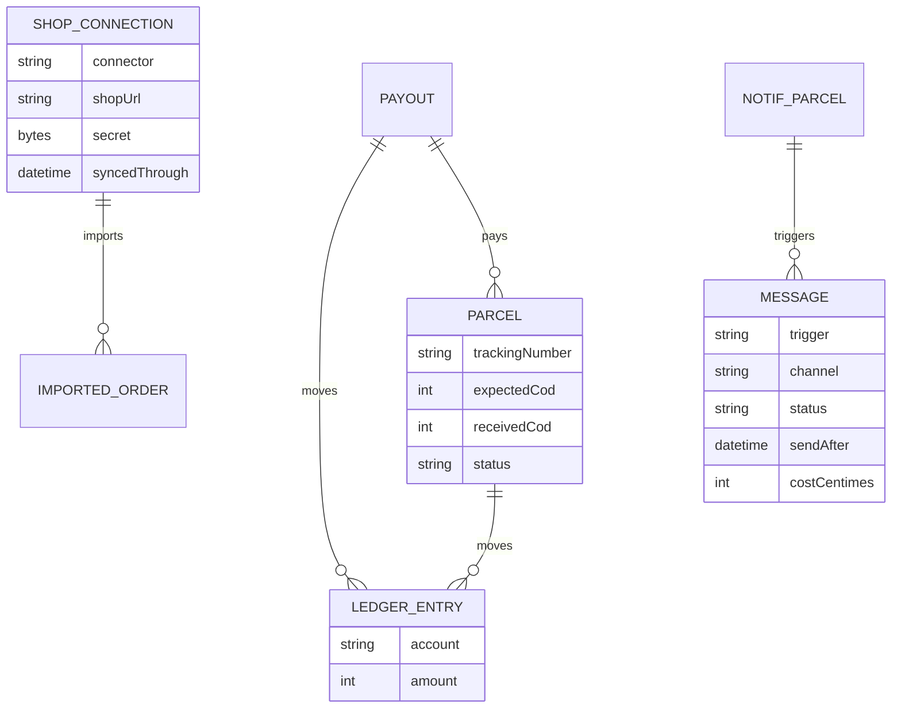
```mermaid
erDiagram
    PARCEL ||--o{ LEDGER_ENTRY : moves
    PAYOUT ||--o{ LEDGER_ENTRY : moves
    PAYOUT ||--o{ PARCEL : pays
    SHOP_CONNECTION ||--o{ IMPORTED_ORDER : imports
    NOTIF_PARCEL ||--o{ MESSAGE : triggers
    PARCEL {
        string trackingNumber
        int expectedCod
        int receivedCod
        string status
    }
    LEDGER_ENTRY {
        string account
        int amount
    }
    MESSAGE {
        string trigger
        string channel
        string status
        datetime sendAfter
        int costCentimes
    }
    SHOP_CONNECTION {
        string connector
        string shopUrl
        bytes secret
        datetime syncedThrough
    }
```

The four diagrams are identity, orders, shipping, then payments + notifications + integrations. `NOTIF_PARCEL` is notifications' own small copy of shipments (public code per shipment), filled from events.

## 12. Order and parcel status

The full order state machine is in [docs/order-status.md](../order-status.md). How carrier parcel statuses drive the order:

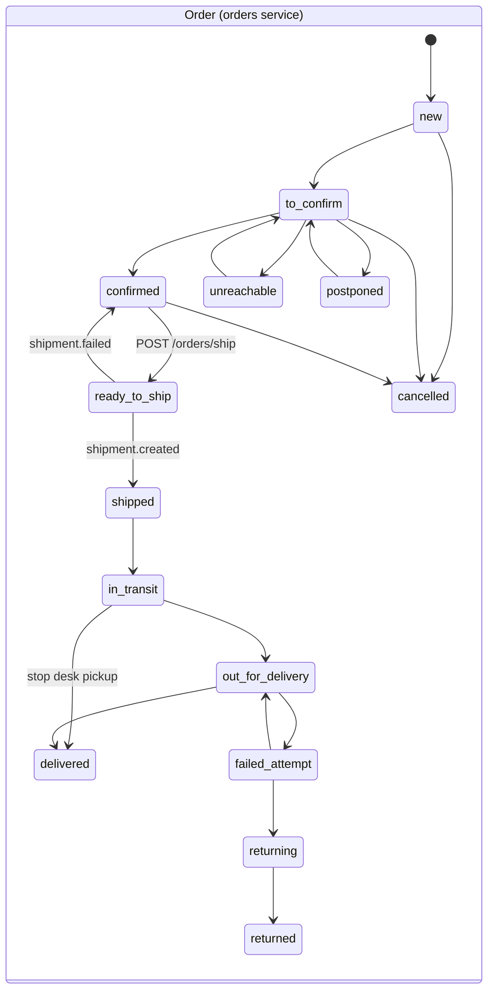
```mermaid
stateDiagram-v2
    direction LR
    state "Order (orders service)" as ord {
        [*] --> new
        new --> to_confirm
        to_confirm --> confirmed
        to_confirm --> unreachable
        to_confirm --> postponed
        unreachable --> to_confirm
        postponed --> to_confirm
        confirmed --> ready_to_ship: POST /orders/ship
        ready_to_ship --> shipped: shipment.created
        ready_to_ship --> confirmed: shipment.failed
        shipped --> in_transit
        in_transit --> out_for_delivery
        in_transit --> delivered: stop desk pickup
        out_for_delivery --> delivered
        out_for_delivery --> failed_attempt
        failed_attempt --> out_for_delivery
        failed_attempt --> returning
        returning --> returned
        new --> cancelled
        to_confirm --> cancelled
        confirmed --> cancelled
    }
```

| Parcel status (carrier, normalised) | Order status it sets | Polled every |
|---|---|---|
| `created` | (none, shipment flow sets `shipped`) | 60 min |
| `picked_up` | `in_transit` | 60 min |
| `in_transit` | `in_transit` | 120 min |
| `out_for_delivery` | `out_for_delivery` | 10 min |
| `failed_attempt` | `failed_attempt` | 30 min |
| `returning` | `returning` | 240 min |
| `delivered` | `delivered` | stops |
| `returned` | `returned` | stops |
| `cancelled` | (none, back to the seller) | stops |

## 13. Deployment

Phases 0 to 2: one container host per environment (ADR-0001, `deploy/compose.yml`, `docs/runbook.md`).

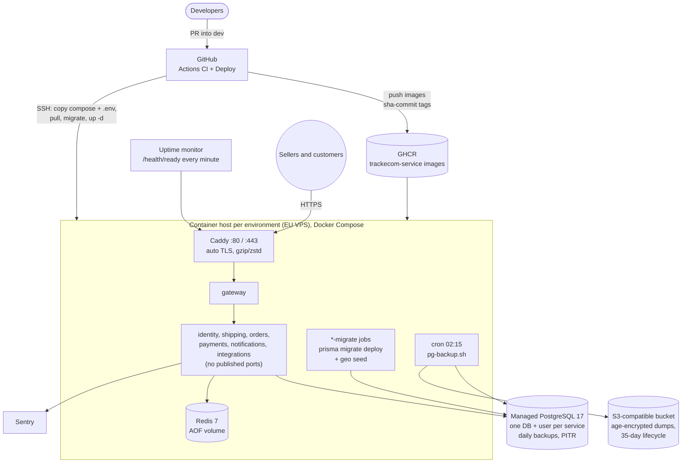
```mermaid
flowchart TB
    dev(["Developers"]) -->|"PR into dev"| gh["GitHub<br/>Actions CI + Deploy"]
    gh -->|"push images<br/>sha-commit tags"| ghcr[("GHCR<br/>trackecom-service images")]

    subgraph host["Container host per environment (EU VPS), Docker Compose"]
        caddy["Caddy :80 / :443<br/>auto TLS, gzip/zstd"]
        gw[gateway]
        svc["identity, shipping, orders,<br/>payments, notifications, integrations<br/>(no published ports)"]
        mig["*-migrate jobs<br/>prisma migrate deploy<br/>+ geo seed"]
        redis[("Redis 7<br/>AOF volume")]
        cron["cron 02:15<br/>pg-backup.sh"]
    end

    pg[("Managed PostgreSQL 17<br/>one DB + user per service<br/>daily backups, PITR")]
    s3[("S3-compatible bucket<br/>age-encrypted dumps,<br/>35-day lifecycle")]
    sentry["Sentry"]
    uptime["Uptime monitor<br/>/health/ready every minute"]

    gh -->|"SSH: copy compose + .env,<br/>pull, migrate, up -d"| host
    ghcr --> host
    internet(("Sellers and customers")) -->|HTTPS| caddy --> gw --> svc
    mig --> pg
    svc --> pg
    svc --> redis
    cron --> pg
    cron --> s3
    svc --> sentry
    uptime --> caddy
```

## 14. CI/CD and environments

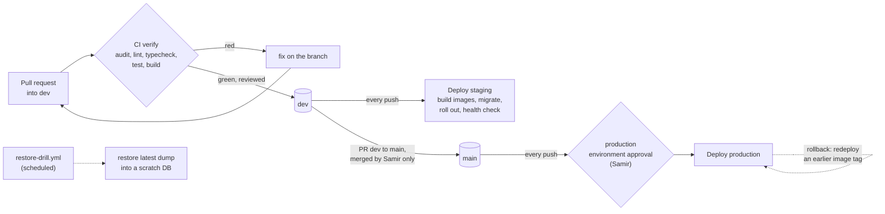
```mermaid
flowchart LR
    pr["Pull request<br/>into dev"] --> ci{"CI verify<br/>audit, lint, typecheck,<br/>test, build"}
    ci -->|red| fix["fix on the branch"]
    fix --> pr
    ci -->|green, reviewed| dev[("dev")]
    dev -->|"every push"| stg["Deploy staging<br/>build images, migrate,<br/>roll out, health check"]
    dev -->|"PR dev to main,<br/>merged by Samir only"| main[("main")]
    main -->|"every push"| appr{"production<br/>environment approval<br/>(Samir)"}
    appr --> prod["Deploy production"]
    prod -.->|"rollback: redeploy<br/>an earlier image tag"| prod
    sched["restore-drill.yml<br/>(scheduled)"] -.-> drill["restore latest dump<br/>into a scratch DB"]
```

## 15. Target architecture (Phase 3 and 4)

What the roadmap adds. Dashed nodes are planned; ADRs are required before each new service.

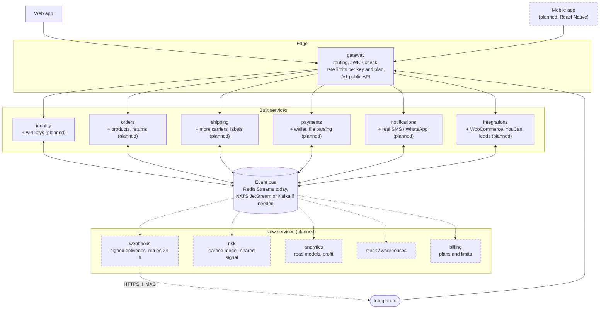
```mermaid
flowchart TB
    web["Web app"]
    mobile["Mobile app<br/>(planned, React Native)"]
    devs(["Integrators"])

    subgraph edge["Edge"]
        gw["gateway<br/>routing, JWKS check,<br/>rate limits per key and plan,<br/>/v1 public API"]
    end

    subgraph core["Built services"]
        identity["identity<br/>+ API keys (planned)"]
        orders["orders<br/>+ products, returns (planned)"]
        shipping["shipping<br/>+ more carriers, labels (planned)"]
        payments["payments<br/>+ wallet, file parsing (planned)"]
        notifications["notifications<br/>+ real SMS / WhatsApp (planned)"]
        integrations["integrations<br/>+ WooCommerce, YouCan, leads (planned)"]
    end

    subgraph next["New services (planned)"]
        webhooks["webhooks<br/>signed deliveries, retries 24 h"]
        risk["risk<br/>learned model, shared signal"]
        analytics["analytics<br/>read models, profit"]
        stock["stock / warehouses"]
        billing["billing<br/>plans and limits"]
    end

    bus[("Event bus<br/>Redis Streams today,<br/>NATS JetStream or Kafka if needed")]

    web & mobile --> gw
    devs --> gw
    gw --> identity & orders & shipping & payments & notifications & integrations
    identity & orders & shipping & payments & notifications & integrations <--> bus
    bus -.-> webhooks & risk & analytics & stock & billing
    webhooks -.->|"HTTPS, HMAC"| devs
    classDef planned stroke-dasharray: 5 5
    class mobile,webhooks,risk,analytics,stock,billing planned
```

Scale-out path: the same images move to Kubernetes (k3s or managed) with autoscaling per service and per worker type (`WORKERS_ENABLED`), and the whole stack can move to an Algerian data centre because it uses only containers, PostgreSQL and Redis.
